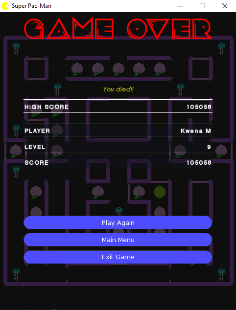

# Super Pac-Man clone

This project is a [Super Pac-Man](https://en.wikipedia.org/wiki/Super_Pac-Man) using my 2D game engine, [Infinite Motion Engine](https://github.com/KwenaMashamaite/IME). 
This game uses the same core logic as my [clone](https://github.com/KwenaMashamaite/PacMan) of the original Pac-Man game.

## How to play

1. [Download](https://github.com/KwenaMashamaite/SuperPacMan/releases/tag/v1.2.1)
   the latest game version
2. Extract the zip archive
3. Run _SuperPacMan.exe_
4. Enjoy :video_game:

###### Watch the gameplay on [Youtube](https://youtu.be/TtjpNSaZla8)

## Screenshots

1. First time boot screen


2. Default boot screen


3. Loading screen


4. Main Menu


5. Level start


6. Gameplay


7. Bonus stage


8. Pause Menu 


9. Game Over Menu



## Build

###### *Read this section if you want to build the game yourself, otherwise you may skip it.*

This project is a CMake project, therefore you must download and install [CMake](https://cmake.org/). 
You also need to download [Infinite Motion Engine v3.0.0](https://github.com/KwenaMashamaite/IME/releases/tag/v3.0.0). 
Then:

1. Clone the repository
```git
$ git clone https://github.com/KwenaMashamaite/SuperPacMan
```   
2. Create a folder in the root of the directory created in step 1 and name it `extlibs`
3. Extract **IME** to the `extlibs` folder created in step 2. It should look like:


   
At this point your ready to build the project. You may use an IDE that supports building with *CMake*.
or the *CLI* using the the following commands:

```shell
mkdir build
cd build
cmake ..
cmake --build .
```

The executable can be found in the `bin` directory

## Platform

This game only runs on the Windows platform. It was tested on Windows 10 but 
should work with previous versions

## License

This game is released under the [MIT](LICENSE) license
