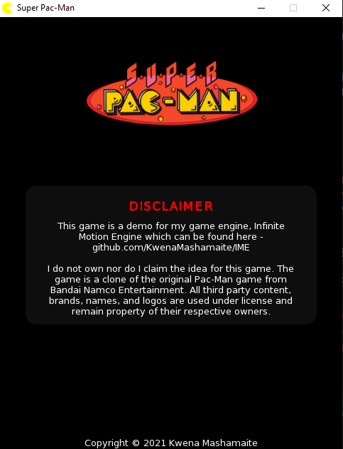

# Super Pac-Man

[Super Pac-Man](https://en.wikipedia.org/wiki/Super_Pac-Man) is an arcade game
that was created in 1982 as a spin-off from the popular Pac-Man game.

## Overview

This project is a Super Pac-Man clone using the [Infinite Motion Engine](https://github.com/KwenaMashamaite/IME), 
a 2D game engine that I developed. The game uses the same core logic and a UI as my [clone](https://github.com/KwenaMashamaite/PacMan) 
of the original Pac-Man game.

## How to play

1. [Download](https://github.com/KwenaMashamaite/SuperPacMan/releases/tag/v0.1)
   the latest game version
2. Extract the zip archive
3. Run _SuperPacMan.exe_
4. Enjoy :video_game:

## Screenshots

1. Startup Scene



2. Main Menu Scene


3. Gameplay Scene


4. Pause Menu Scene


4. Game Over Scene


## Build

###### *Read this section if you want to build the game yourself, otherwise you may skip it.*

This project is a CMake project, therefore you must download and install [CMake](https://cmake.org/). 
You also need to download [Infinite Motion Engine v2.2.0](https://github.com/KwenaMashamaite/IME/releases/tag/v2.2.0) or higher. 
Then:

1. Clone the repository
```git
$ git clone https://github.com/KwenaMashamaite/SuperPacMan
```   
2. Create a folder in the root of the directoryK created in step 1 and name it `extlibs`
3. Extract **IME** to the `extlibs` folder created in step 2. It should look like:


   
At this point your ready to build the project. The easiest way to do this is to
use an IDE that supports building with *CMake*. I recommend using [CLion](https://www.jetbrains.com/clion/) (Paid - Free 30 day trial) 
or [Visual Studio Community](https://visualstudio.microsoft.com/vs/community/) (Free)

To build the game using the *CLI*, run the following commands from the project root 
directory:

```shell
mkdir build
cd build
cmake ..
cmake --build .
```

After the build process completes, you will find the game executable in `SuperPacMan/bin`
folder

## Platform

This game only runs on the Windows platform. It was tested on Windows 10.
